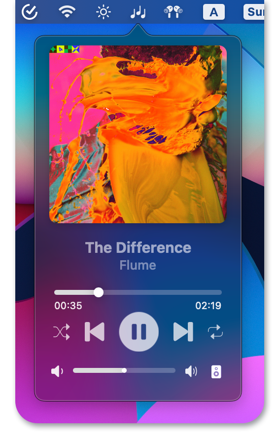
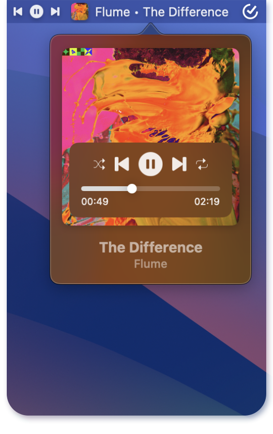
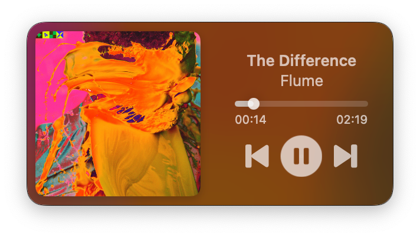
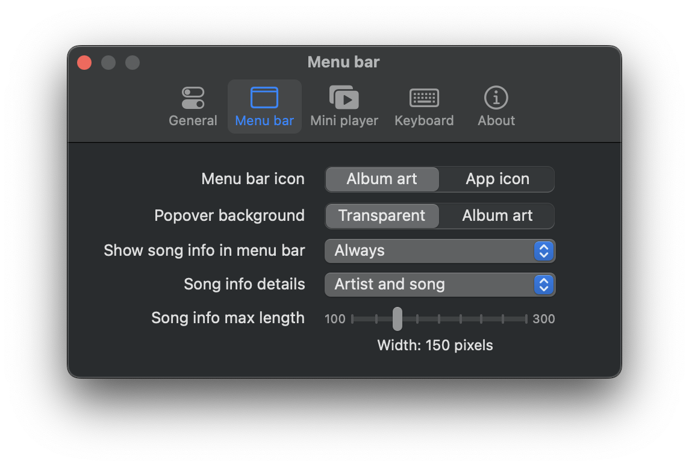

  

  <h3 align="center">Tuneful</h3>

  

    Tuneful is a native macOS playback control app for Spotify and Apple Music which provides a convenient way to control your music from menu bar and optional mini player.
     
    <a href="https://martinfekete.com/Tuneful/">Website</a>
    ·
    <a href="https://ko-fi.com/martinfekete">Support</a>
    ·
    <a href="https://github.com/martinfekete10/Tuneful/issues">Report Bug</a>
    ·
    <a href="https://github.com/martinfekete10/Tuneful/issues">Request Feature</a>
  

<h5 align="center">Tuneful requires macOS 13 Ventura or newer</h5>

## Installation

> [!WARNING]
> This app has not been notarized by Apple and a popup will be shown on first start. Click **Okay**, then go to **Settings > Privacy & Security** and scroll down and click on a **Open anyway** button next to **Tunfeul** - you'll need to do this only once.
> If you're running macOS older than Sequoia, right-click on the app icon in Finder and select "Open".

### Tuneful can be installed using standard installation process

1. Download the latest [releases](https://github.com/martinfekete10/Tuneful/releases/latest/download/Tuneful.dmg)
2. Open the downloaded `.dmg` file and drag the app to your Applications folder
3. Launch the app, select you preferred streaming service and enjoy!

### Or using Homebrew

`brew install martinfekete10/tap/tuneful`

## Screenshots

  
  

  
  

  

## Feedback

Your feedback is important to us. If you encounter any issues or have suggestions for improvement, please [open an issue](https://github.com/martinfekete10/Tuneful/issues).

## Support

If you find this app useful, consider supporting its development by [donating](https://ko-fi.com/martinfekete).

## Acknowledgments

-   Project is partly based on [Jukebox](https://github.com/Jaysce/Jukebox/tree/main)
-   This project uses [Sparkle](https://sparkle-project.org) for update delivery
-   Launch at login is enabled by [LaunchAtLogin](https://github.com/sindresorhus/LaunchAtLogin) package
-   GitHub Actions are based on repo from [Alex Perathoner](https://github.com/AlexPerathoner/SparkleReleaseTest)
-   For Settings, the project uses [Settings](https://github.com/sindresorhus/Settings) package

---

_Thank you for using Tuneful!_
