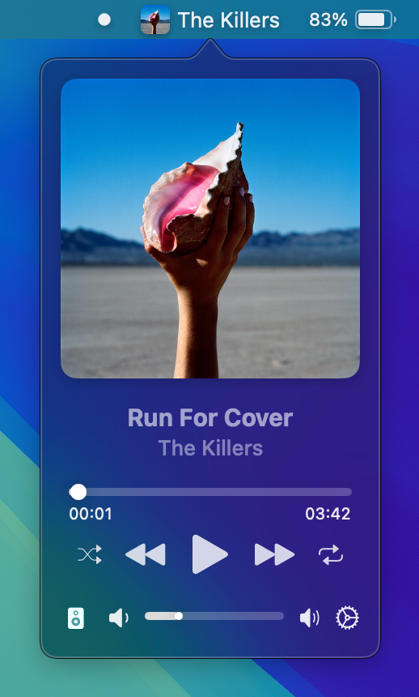
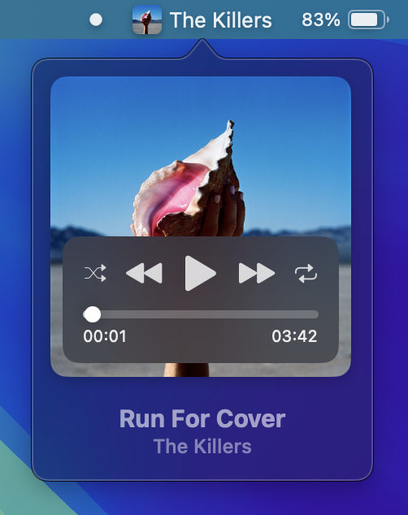
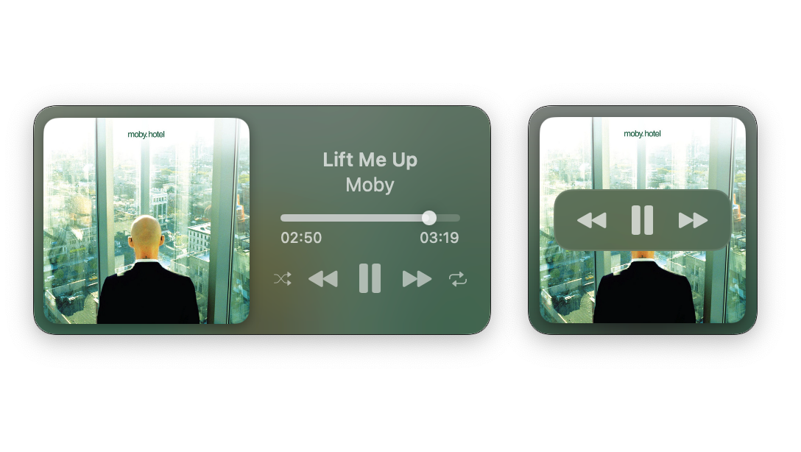

  

  <h3 align="center">Tuneful</h3>

  

    Tuneful is a native macOS playback control app for Spotify and Apple Music which provides a convenient way to control your music from menu bar and optional mini player.
     
    <a href="https://tuneful.dev/">Website</a>
    ·
    <a href="https://ko-fi.com/martinfekete">Support</a>
    ·
    <a href="https://github.com/martinfekete10/Tuneful/issues">Report Bug</a>
    ·
    <a href="https://github.com/martinfekete10/Tuneful/issues">Request Feature</a>
  

  

<h5 align="center">Tuneful requires macOS 13 Ventura or newer</h5>

## Screenshots

  

  

  

## Feedback

Your feedback is important to us. If you encounter any issues or have suggestions for improvement, please [open an issue](https://github.com/martinfekete10/Tuneful/issues).

## Support

If you find this app useful, consider supporting its development by [donating](https://ko-fi.com/martinfekete).

## Acknowledgments

-   Project is partly based on [Jukebox](https://github.com/Jaysce/Jukebox/tree/main)
-   This project uses [Sparkle](https://sparkle-project.org) for update delivery
-   Launch at login is enabled by [LaunchAtLogin](https://github.com/sindresorhus/LaunchAtLogin) package
-   GitHub Actions are based on repo from [Alex Perathoner](https://github.com/AlexPerathoner/SparkleReleaseTest)
-   For Settings, the project uses [Settings](https://github.com/sindresorhus/Settings) package
-   Tuneful uses [DynamicNotchKit](https://github.com/MrKai77/DynamicNotchKit)
    for notification animations

---

_Thank you for using Tuneful!_
