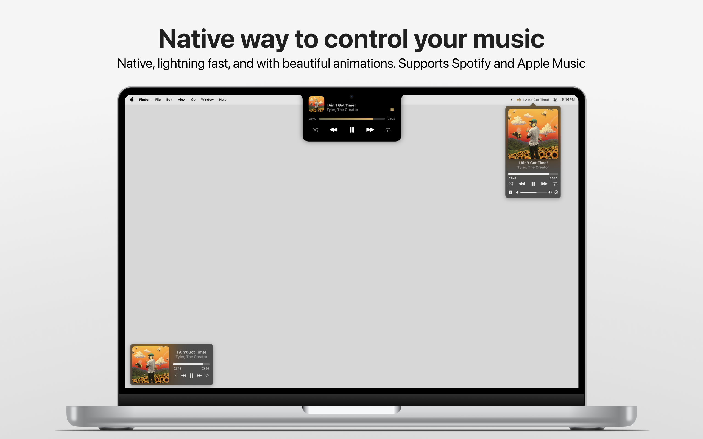

  

  <h3 align="center">Tuneful</h3>

  

    Tuneful is a native macOS playback control app for Spotify and Apple Music
     
    <a href="https://tuneful.dev/">Website</a>
    ·
    <a href="https://ko-fi.com/martinfekete">Support</a>
    ·
    <a href="https://github.com/martinfekete10/Tuneful/issues">Report Bug</a>
    ·
    <a href="https://github.com/martinfekete10/Tuneful/issues">Request Feature</a>
  

  

  

## Feedback

If you encounter any issues or have suggestions for improvement, please [open an issue](https://github.com/martinfekete10/Tuneful/issues).

## Support

If you find Tuneful useful, consider supporting its development by [donating](https://ko-fi.com/martinfekete).

## Acknowledgments

-   Project is partly based on [Jukebox](https://github.com/Jaysce/Jukebox/tree/main)
-   Launch at login is enabled by [LaunchAtLogin](https://github.com/sindresorhus/LaunchAtLogin) package
-   For Settings, the project uses [Settings](https://github.com/sindresorhus/Settings) package
-   Tuneful notch integration is based on [DynamicNotchKit](https://github.com/MrKai77/DynamicNotchKit)
-   Tuneful uses [Luminare](https://github.com/MrKai77/Luminare) for UI elements in settings
