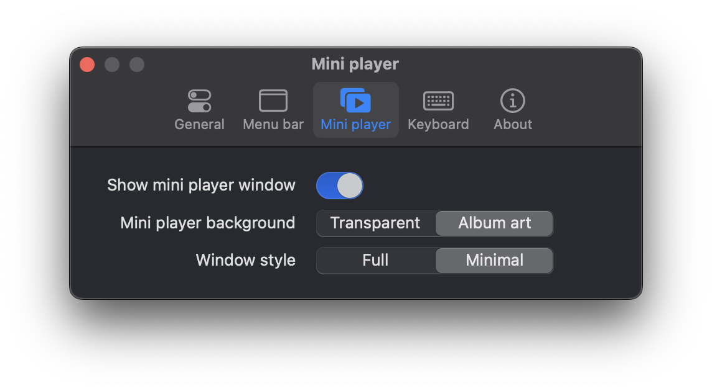
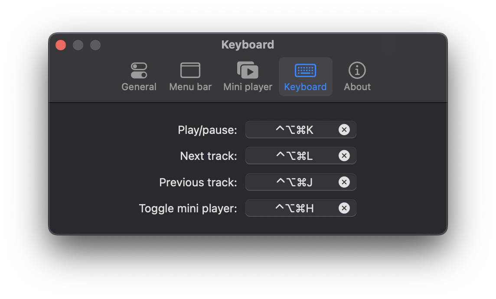

  

  <h3 align="center">Tuneful</h3>

  

    Tuneful is a native macOS playback control app for Spotify and Apple Music which provides a convenient way to control your music from menu bar and optional mini player.
     
    <a href="https://martinfekete.com/Tuneful/">Website</a>
    ·
    <a href="https://ko-fi.com/martinfekete">Support</a>
    ·
    <a href="https://github.com/martinfekete10/Tuneful/issues">Report Bug</a>
    ·
    <a href="https://github.com/martinfekete10/Tuneful/issues">Request Feature</a>
  

# About

Tuneful provides a convenient way to control music playback for Spotify and Apple Music, and see the currently playing song directly in the menu bar. Tuneful allows you to manage audio player volume, set the audio output device, and features a customizable mini player that is always on top of your workspace.

**Tuneful requires macOS 13 Ventura or greater.**

## Screenshots

  

  
  

## Settings

  
  
  

## Features

### 1. Playback Control
Tuneful seamlessly integrates with both Spotify and Apple Music. Easily control your music from menu bar or mini player window and see currently playing song and/or artist directly in menu bar. You can customize the look of menu bar and mini player in the settings.

### 2. Audio settings control
Adjust the volume of your music player directly from the menu bar. Choose your preferred audio output device with a single click. Switch between headphones, speakers, and other connected devices effortlessly.

### 3. Global Keyboard Shortcuts
Setup global keyboard shortcuts to control your music and hide/show the mini player window.

## Installation

1. Download the latest release from the [Releases](https://github.com/martinfekete10/Tuneful/releases) page.
2. Open the downloaded `.dmg` file and drag the app to your Applications folder.
3. Launch the app, select you preferred streaming service and enjoy!

## Feedback

Your feedback is important to us. If you encounter any issues or have suggestions for improvement, please [open an issue](https://github.com/martinfekete10/Tuneful/issues).

## Support

If you find this app useful, consider supporting its development by [donating](https://ko-fi.com/martinfekete).

## Acknowledgments

- Project is partly based on [Jukebox](https://github.com/Jaysce/Jukebox/tree/main)
- This project uses [Sparkle](https://sparkle-project.org) for update delivery
- This project makes use of [LaunchAtLogin](https://github.com/sindresorhus/LaunchAtLogin)
- GitHub Actions are based on repo from [Alex Perathoner](https://github.com/AlexPerathoner/SparkleReleaseTest)
- Settings window is using [Settings](https://github.com/sindresorhus/Settings) Swift package

---

*Thank you for using Tuneful!*
