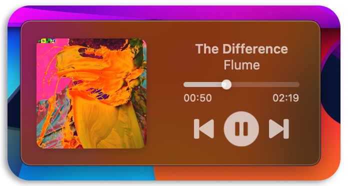
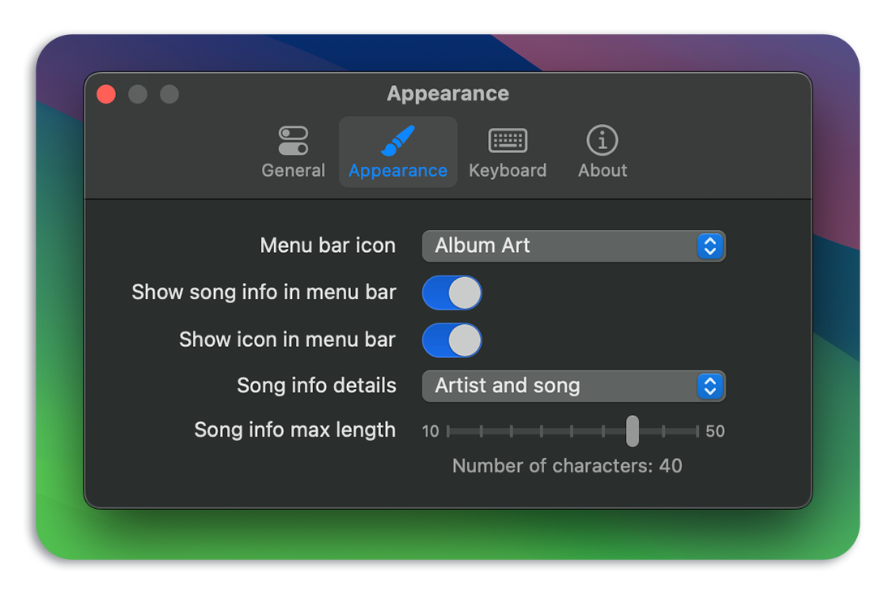
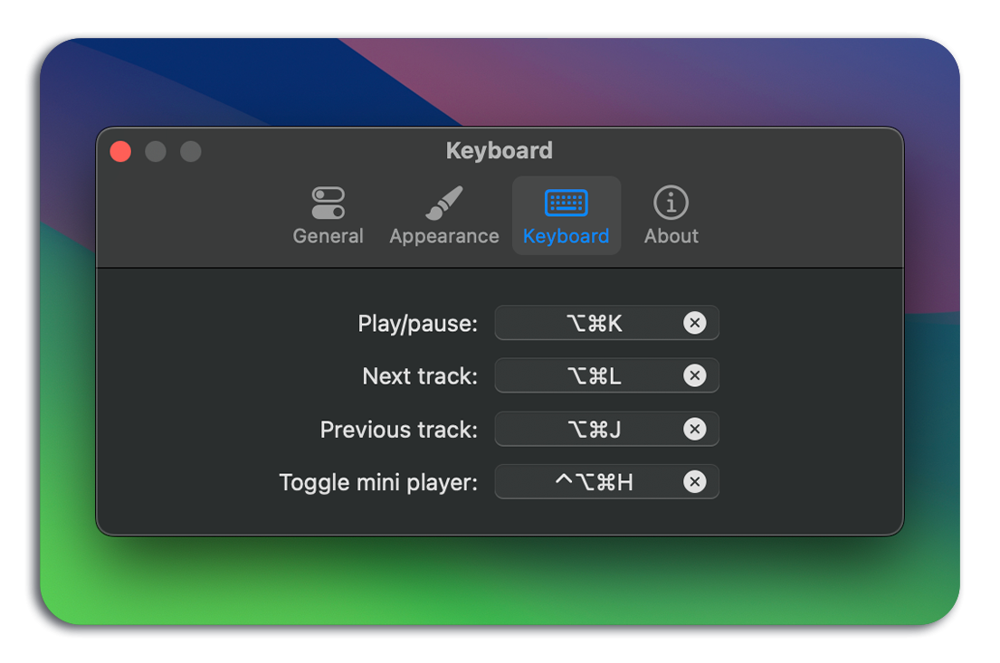

  

  <h3 align="center">Tuneful</h3>

  

    Tuneful is a native macOS menu bar playback control app for Spotify and Apple Music
     
    <a href="https://github.com/martinfekete10/Tuneful/issues">Report Bug</a>
    ·
    <a href="https://github.com/martinfekete10/Tuneful/issues">Request Feature</a>
  

# About

Tuneful provides a convenient way to control music playback for both Spotify and Apple Music, and see the currently playing song directly in the menu bar. Enjoy seamless control over your music, including playback, shuffle, and repeat options. Additionally, the app allows you to manage system volume, set the audio output device, and features a mini player window.

**Tuneful requires macOS 13 Ventura or greater.**

  

  

  

  

## Features

### 1. Playback Control
Easily play, pause, skip, and go back to previous tracks without switching between applications. Tuneful seamlessly integrates with both Spotify and Apple Music.

### 2. Currently Playing Song in Menu Bar
See currently playing song and/or artist directly in menu bar. You can customise the information displayed in the menu bar in Tuneful settings.

### 3. System Volume Control
Adjust the system volume directly from the menu bar. No need to open additional settings or apps to modify your sound preferences.

### 4. Audio Output Device
Choose your preferred audio output device with a single click. Switch between headphones, speakers, and other connected devices effortlessly.

### 5. Mini Player Window
Mini player window provides a compact view of the current track information and playback controls. Keep an eye on your music without disrupting your workflow.

### 6. Global Keyboard Shortcuts
Setup global keyboard shortcuts to control your music and hide/show the mini player window.

## Installation

1. Download the latest release from the [Releases](https://github.com/martinfekete10/Tuneful/releases) page.
2. Open the downloaded `.dmg` file and drag the app to your Applications folder.
3. Launch the app, select you preferred streaming service and enjoy!

## Feedback

Your feedback is important to us. If you encounter any issues or have suggestions for improvement, please [open an issue](https://github.com/martinfekete10/Tuneful/issues).

## Support

If you find this app useful, consider supporting its development by [donating](https://ko-fi.com/martinfekete).

## Acknowledgments

- Project is partly based on [Jukebox](https://github.com/Jaysce/Jukebox/tree/main)
- This project uses [Sparkle](https://sparkle-project.org) for update delivery
- This project makes use of [LaunchAtLogin](https://github.com/sindresorhus/LaunchAtLogin)
- GitHub Actions are based on repo from [Alex Perathoner](https://github.com/AlexPerathoner/SparkleReleaseTest)
- Settings window is using [Settings](https://github.com/sindresorhus/Settings) Swift package

---

*Thank you for using Tuneful!*
