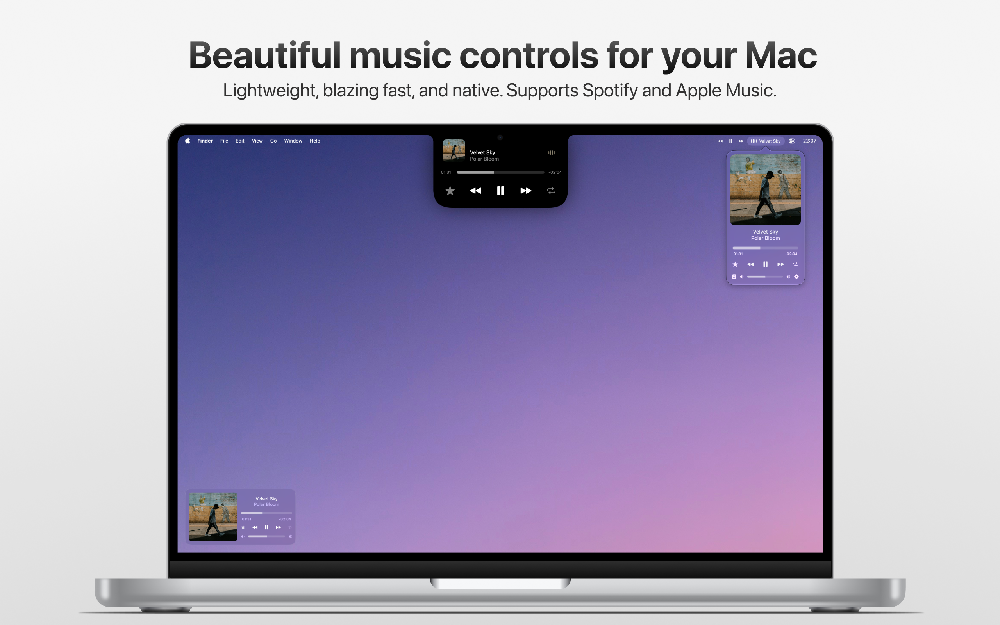

  

  <h1 align="center">Tuneful</h1>

  

    
  

  

    Beautiful music controls for your Mac. Native and lightning fast.
     
    <a href="https://tuneful.app/">Website</a>
    ·
    <a href="https://apps.apple.com/us/app/tuneful/id6739804295?mt=12&action=write-review">Write a review</a>
    ·
    <a href="https://x.com/martin__fekete">X</a>
    ·
    <a href="https://www.threads.net/@martin__fekete">Threads</a>

  

  

    
  

## Features

Tuneful brings native music controls for Spotify and Apple Music to your Mac. Choose the notch, menu bar, or mini player.

- **Notch player:** Hover over your MacBook's notch for quick music controls and satisfying haptic feedback.
- **Menu bar player:** See what's playing and use the built-in playback controls from a customizable popover.
- **Mini player:** Keep a compact player on screen and choose a style that suits you.
- **Favorites and integrations:** Save songs from any player, and connect Spotify or Last.fm for scrobbling and Now Playing updates.
- **Make it yours:** Customize the notch, menu bar, mini player, and keyboard shortcuts. Enable only the interfaces you want.
- **Native and lightweight:** Built with Swift and SwiftUI for a fast, smooth experience that uses minimal system resources.

## Feedback

If you encounter any issues or have any feature requests, please [open an issue](https://github.com/martinfekete10/Tuneful/issues).
